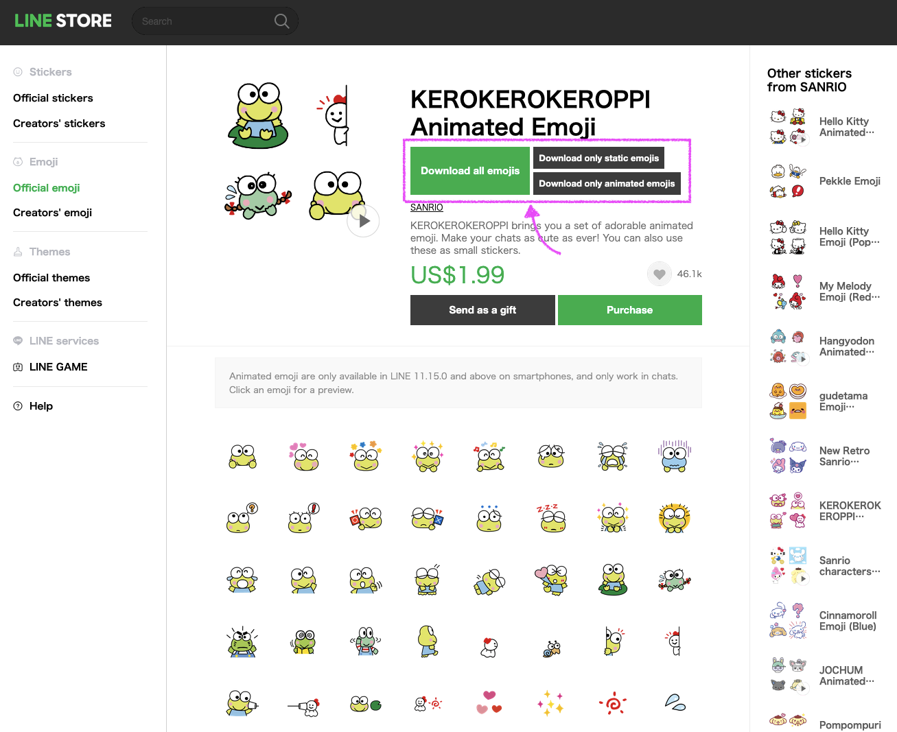
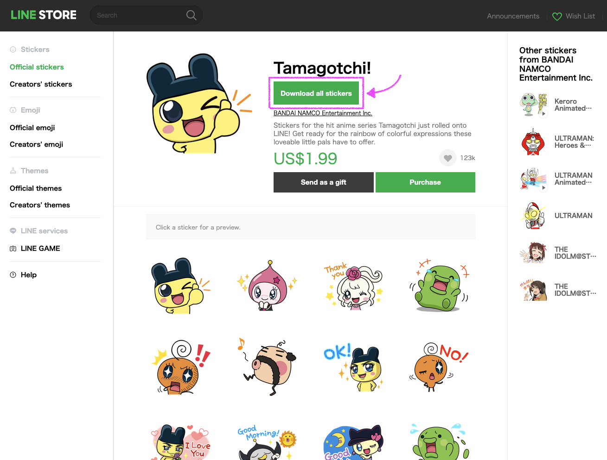
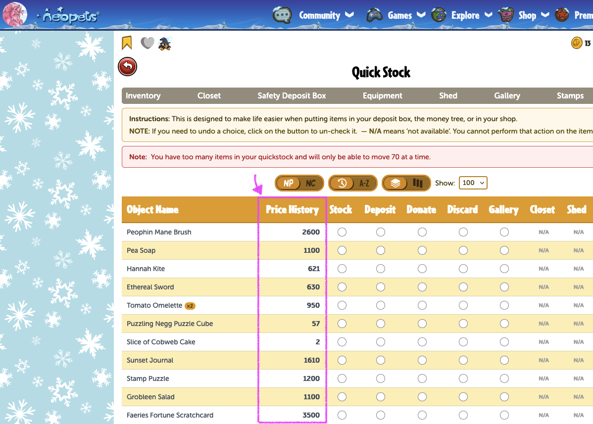
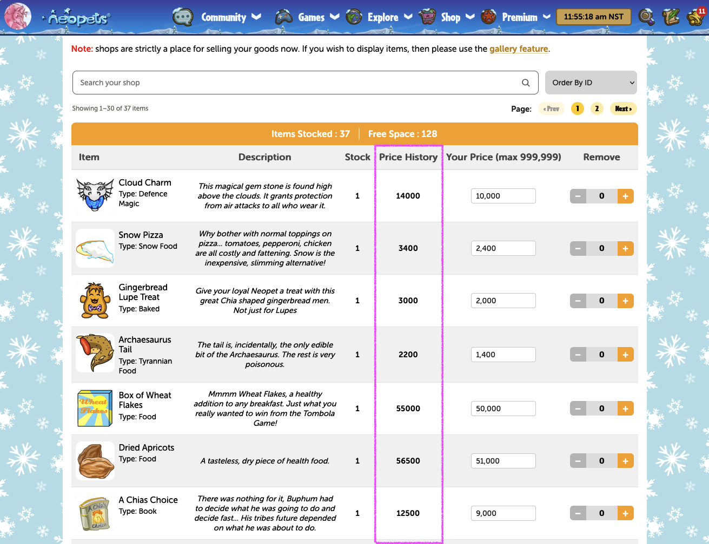

# Manacake.co's Userscripts (´･ᴗ･ ` )
I wrote some userscripts for improving my experience consuming web content. My scripts cover the topics below. Feel free to peruse and install any that may interest you. Maybe my scripts will inspire and help you write your own as well?

### Userscript topics
* [Line Store](#line-store)
* [Neopets](#neopets)

## What are userscripts?

Userscripts are custom Javascript programs written by people (like you and me) that would like to enhance or modify any website's original functionality and/or appearance. The scripts can add new features or transform existing ones to make a website easier/more fun to use. Due to the nature of scripting, anyone can write one so you should exercise caution when picking scripts to install. Only install from trusted sources and/or after you have personally vetted the source code.

## How to install a userscript?
There is a popular browser extension called [Tampermonkey](https://www.tampermonkey.net/) that will let you create, manage, and run custom userscripts on any website you visit. ***After installing*** Tampermonkey, you can then install any custom userscripts you want to execute. To download my userscripts specifically, click on the installation buttons below or click on the [Raw] button when visiting individual scripts in this repository.

## Line Store

### Line Emoji Downloader

<a href="https://raw.githubusercontent.com/manacake/userscripts/main/lineEmojiDownloader.user.js" target="_blank"><button style="padding:16px; background:#00B84F; color:#FFF; font-weight:bold; border:0; cursor:pointer;">Install Line Emoji Downloader</button></a>

I wanted to access the emojis I have already purchased so I can use them in other places in my personal life (e.g. digital note-keeping, external chat programs, etc.) For the animated emojis, I made the option to download either (a) the static versions of the animations or (b) the animated versions or (c) both types (static and animated)! For static-only emojis, there is specifically only one download button. Please support your artists and purchase their work before downloading... unless it was ai generated in which case, download at will because to hell with ai slop.

To browse available emojis, see [Line Store's emoji catalog](https://store.line.me/emojishop/home/general/en).

### Line Sticker Downloader

<a href="https://raw.githubusercontent.com/manacake/userscripts/main/lineStickerDownloader.user.js" target="_blank"><button style="padding:16px; background:#00B84F; color:#FFF; font-weight:bold; border:0; cursor:pointer;">Install Line Sticker Downloader</button></a>

Similarly to the Line emoji issue I had, I also wanted the option to download stickers and sticker-packs that I have previously purchased. I did notice that there was an existing .zip endpoint floating around that served this purpose with one big caveat:

> [!IMPORTANT]
> Due to the endpoint not having a valid secure protocol, there is a possibility that the download might not complete properly without manual intervention. Usually, modern browsers will halt the .zip download because the Line sticker page is served over HTTPS while the download is served over HTTP. In order to follow through, you must click [Allow Download] manually by checking your browser's downloads UI. Also, if the .zip gets corrupted somehow, try downloading in a different browser. (You can peek the download URL in the console)

This works *just fine* albeit a little janky. (￣▽￣*)ゞ I also presume the same technique found in my Line emoji downloader would work on Line stickers as well (with some retrofitting adjustments, but that's for a future edit).

To browse available stickers, see [Line Store's sticker catalog](https://store.line.me/stickershop/home/general/en).

## Neopets

### Quick Stock Pricer

<a href="https://raw.githubusercontent.com/manacake/userscripts/main/neopetsQuickStockPricer.user.js" target="_blank"><button style="padding:16px; background:#FED123; border:4px solid #FAA819; border-radius: 12px; font-weight:bold; cursor:pointer;">Install Neopets Quick Stock Pricer</button></a>

I wanted to see the latest NP pricing value of each item on my quick stock page so I can best determine what to do with that item. Should I stock, deposit, or donate it? If the item's value is currently inflated, the NP value will be colored in red. This script uses data from the [itemdb API](https://itemdb.com.br/).

### Shop Stock Pricer

<a href="https://raw.githubusercontent.com/manacake/userscripts/main/neopetsShopStockPricer.user.js" target="_blank"><button style="padding:16px; background:#FED123; border:4px solid #FAA819; border-radius: 12px; font-weight:bold; cursor:pointer;">Install Neopets Shop Stock Pricer</button></a>

I never know what value to price the items in my shop. Now with this helper, you can see a quick glance of the latest NP pricing value for the specific item in your store so you can price accordingly. This script uses data from the [itemdb API](https://itemdb.com.br/).

## License & Terms of Use (｡•̀ᴗ-)✧
By using my userscript(s), you agree to the terms of the [CC-BY-NC-4.0](https://creativecommons.org/licenses/by-nc/4.0/) license. Feel free to tinker, adapt to your own work, and share, but please keep it non-commercial and give credit back to [manacake.co](https://manacake.co/). Thank you!